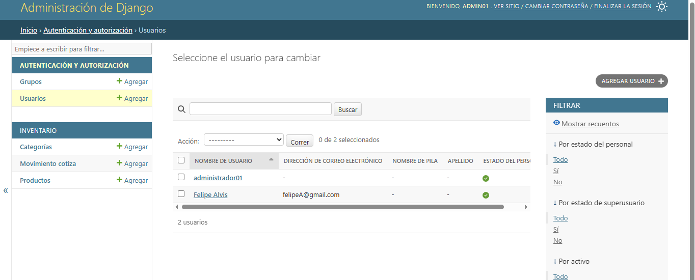
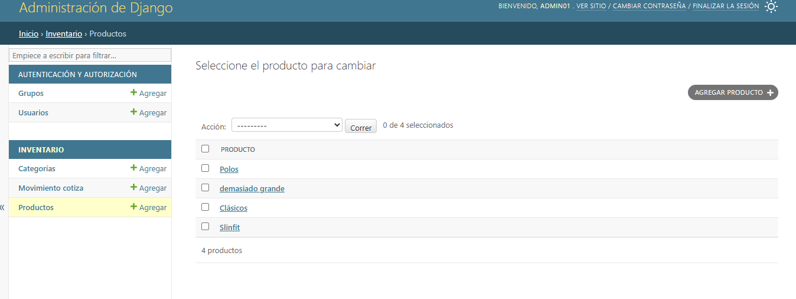
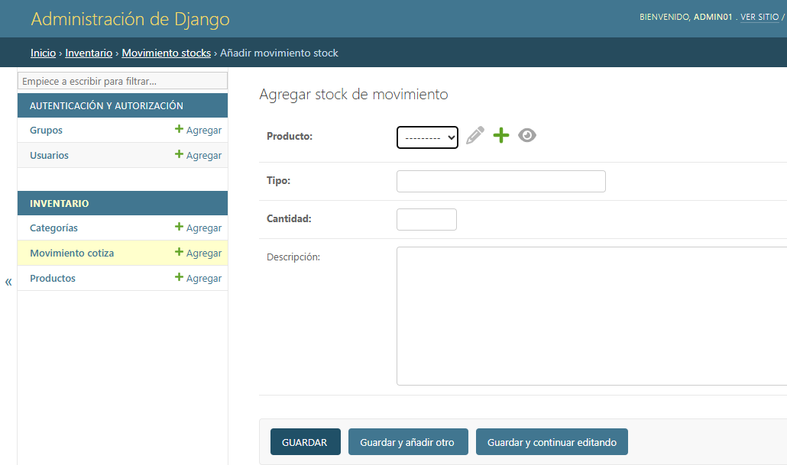

# 📦 Sistema de Gestión de Inventario 

## 🖼️ Vista Previa del Sistema

<table style="width:100%">
  <tr>
    <td width="50%"></td>
    <td width="50%"></td>
  </tr>
  <tr>
    <td align="center"><b>Acceso Seguro</b></td>
    <td align="center"><b>Panel de Usuarios</b></td>
  </tr>
  <tr>
    <td width="50%"></td>
    <td width="50%"></td>
  </tr>
  <tr>
    <td align="center"><b>Inventario de Productos</b></td>
    <td align="center"><b>Registro de Movimientos de Stock</b></td>
  </tr>
</table>


Este es un sistema robusto desarrollado con **Django** para el control de inventarios, diseñado para facilitar el seguimiento de productos, categorías y movimientos de stock en tiempo real.

## 🚀 Características Principales
* **Gestión de Productos:** CRUD completo (Crear, Leer, Actualizar, Eliminar).
* **Categorización:** Organización de productos por categorías.
* **Interfaz Dinámica:** Formularios estilizados con **Crispy Forms** y **Bootstrap 5**.
* **Base de Datos:** Integración con **SQL Server** mediante `pyodbc`.
* **Reportes:** Generación de documentos en PDF usando **ReportLab**.
* **Panel Administrativo:** Control total a través del administrador avanzado de Django.

## 🛠️ Tecnologías Utilizadas
* **Backend:** Python 3.x, Django 6.0
* **Frontend:** HTML5, CSS3, Bootstrap 5
* **Base de Datos:** SQL Server / SQLite (para desarrollo)
* **Librerías clave:** Pillow (Imágenes), ReportLab (PDF), Crispy Forms.

## ⚙️ Instalación y Configuración


1. **Clonar el repositorio:**
   ```bash
   git clone https://github.com/FelipeValencia-Dev90/Inventory-Management-System.git 

2. ** Crear y activar entorno virtual:**
   python -m venv env
   env\Scripts\activate

3. ** Instalar dependencias:**
    pip install -r requisitos.txt

4. ** Ejecutar migraciones y servidor:**
    python gestionar.py migrate
    python gestionar.py runserver

💻 Desarrollado por Andres Valencia A. - 2025
